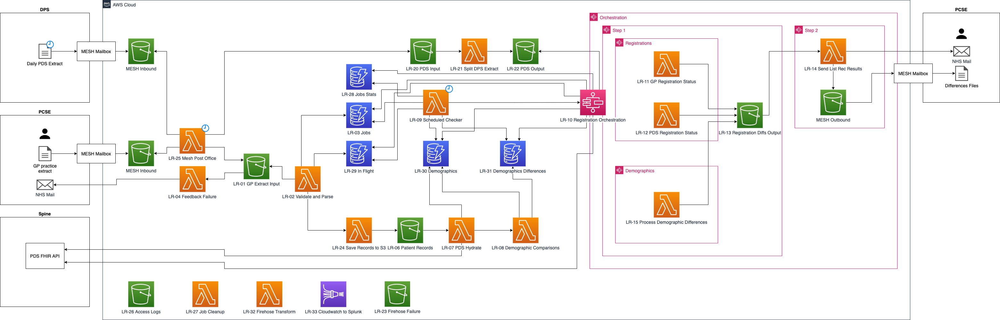

# List Reconciliation

_Part of Primary Care Registration Management (PCRM)_

The List Reconciliation Solution is intended to compare the patient list including the registration and demographic data to facilitate the correction of differences.

## Documentation

### Overview

- [List Reconciliation Components](docs/list-reconciliation-components.md)
- [Glossary](docs/glossary.md)
- [Security](docs/security.md)

### Specifications

- [Input Specification](docs/specifications/input-specification.md)
- [Differences Specification](docs/specifications/differences-specification.md)
- [Output Specification](docs/specifications/output-specification.md)

### Style Guides

- [Terraform Style Guide](docs/terraform-style-guide.md)
- [Python Style Guide](docs/python-style-guide.md)

### Key Architectural Designs

- [List Reconciliation v0.1](docs/kad/list-rec-v0.1.md)
- [List Reconciliation v0.2](docs/kad/list-rec-v0.2.md)

### Key Design Decisions

- [Event Processing](docs/kdd/event-processing.md)

### Packages

- [GP File Parser](packages/gp_file_parser/README.md)

## Architecture Diagram

## Links

[List Reconciliation Solution Walkthrough](https://nhsd-confluence.digital.nhs.uk/display/PCRM/List+Reconciliation+Solution+Walkthrough)

[Developer Guide](https://nhsd-confluence.digital.nhs.uk/display/PCRM/Developer+Guide)

[Key Operating Procedures](https://nhsd-confluence.digital.nhs.uk/display/PCRM/Key+Operating+Procedures+for+List+Reconciliation?src=contextnavpagetreemode)

[Functional Requirements](https://nhsd-confluence.digital.nhs.uk/display/PCRM/Functional+Requirements?src=contextnavpagetreemode)

[Solution Design](https://nhsd-confluence.digital.nhs.uk/display/PCRM/Solution+Design?src=contextnavpagetreemode)

[Testing](https://nhsd-confluence.digital.nhs.uk/display/PCRM/Testing?src=contextnavpagetreemode)

[Service & Support](https://nhsd-confluence.digital.nhs.uk/pages/viewpage.action?pageId=219710650&src=contextnavpagetreemode)
