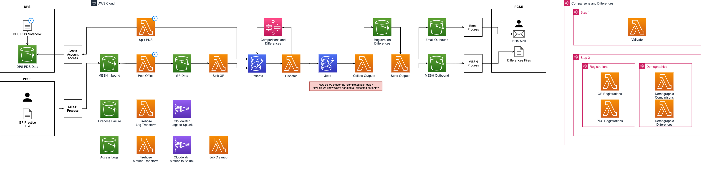

# List Reconciliation v0.2

## Problem

Initially, List Reconciliation is looking to handle around 3 GP Practice files per day, with the average number of patients per GP file at ~10,000, we will be looking to process around 30,000 patients per day.

The largest constraint on processing time is the PDS API, which has a hard limit of 15TPS (transactions per second). With both burst limiting and sustained usage limiting, we have been asked to target a request rate of around 12TPS.

At 12TPS, it will take about 42 minutes of API request time, with the rest of the system overheads, we're looking at under an hour end to end processing time, which is aligned to current timing expectations.

However, even right at the 15TPS limit, we can process at most 1,296,000 PDS API requests in a single day. This gives us a constraint for capacity planning of the current system architecture and assumes no work has or is being done to provide faster PDS APIs. A 1,000TPS PDS API limit would allow for over 70 million API requests and allow all GP Systems to be reconciled each day against PDS.

Even with a potentially higher rate limit PDS API, we should look to evaluate batch transferring of the PDS data which may provide more efficient access to the dataset.

The options below outline potential long term architectural changes for List Reconciliation, that look to meet the long term target of having enough capacity to reconcile all GP Systems each day, if ever required.

## Options

- [AWS Service v0.1](#aws-service-v01)
- [DPS Service](#dps-service)
- [Spine Service](#spine-service)
- [AWS Service v0.2](#aws-service-v02)

## AWS Service v0.1

### Summary

This option is the least amount of work as it focuses on enhancing the existing solution to meet requirements.

However, PDS API usage is against TRG guidance and requires outstanding work for List Rec to implement rate limiting of requests on top of the existing platform improvements.

This solution is based on the assumptions that:

- No PDS API development is being done to allow a higher than 15TPS request rate.
- No change in initial file size expectations of 3 GP Practice files per day, with the average number of patients per GP file at ~10,000

Estimate: ~40 days / ~8 weeks

### Good

- Existing solution
- Been tested with inputs of \<1,000 record files
- Uses the AWS platform
- Decoupled from Spine core

### Bad

- Uses PDS API, so does not meet long term TRG advice
- Incomplete rate limiting implementation of List Rec requests to the PDS API
- PDS API rate limits at maximum 15TPS, ask to aim for ~12TPS
- Cannot support record level validation rejections
- Still needs operational work, forwarding logs to Splunk etc
- Still requires security remediation work and a Pen Test
- APIGEE, which fronts the PDS API, per request resource usage and costings

## DPS Service

### Summary

This solution looks to take the core parsing, validation and comparison Python libraries from the exiting List Rec solution and make use of them as parts of a List Rec service built on top of DPS. Benefiting from the existing DPS platform and supporting libraries, for features like MESH sending of data.

However, this solution requires a large amount of cross skilling and understanding of the DPS system, as well as potential contention of DPS knowledge and development process.

Estimate: TBC (@ramensen is speaking to the DPS Team to gain guidance on an estimate)

### Good

- Aligns to TRG advice
- No initial or upfront platform requirements cost
- Supporting libraries for key functionality, like MESH interaction, already exist
- Opportunity to cross skill Engineers to DPS/Databricks/Spark

### Bad

- Cannot make use of Spine AWS Common Library
- Potentially cannot use Spine logging format (application logs may be able to use Spine format, not 100% sure on what flexibility DPS offers here)
- High coupling on DPS platform (seeing similar issues to Spine: long merge queues, high contention, high barrier to entry on local dev)
- Dependencies on knowledge and time on a non-DPS priority

## Spine Service

### Summary

This solution looks to take the core parsing, validation and comparison Python libraries from the exiting List Rec solution and make use of them as parts of a List Rec service built on top of Spine. Benefiting from the existing Spine platform and supporting libraries.

However, this solution goes back to having coupling and contention with Spine, which was one of the initial driving decisions in working on an AWS based solution.

Estimate: ~40 days / ~8 weeks (To be confirmed. Potentially based on smaller requirement set)

### Good

- Known and well supported infrastructure
- Robust underlying infrastructure

### Bad

- One of the major drivers was to begin to decouple new work
- Will see Spine build and dev process contention
- Removes an opportunity for Engineers to work with AWS
- Resource requirements need adding to overall capacity planning

## AWS Service v0.2

### Summary

This option is a larger amount of work than [AWS Service v0.1](#aws-service-v01) as it involves a revolutionary change of architecture to the solution, oppose to v0.1's evolutionary approach.

The major change is driven by the move from the on demand API to a batch based data ingestion, potentially from DPS or from Spine, as this would necessitate a larger internal datastore, as we'd be holding all of PDS, and changes to the data access patterns compared to the current solution.

There are also some components of the current working solution being identified as inefficient or less optimal, which could be removed or improved on as appropriate.

Estimate: ~50 days / ~10 weeks

### Good

- Full control
- Helps build base functionality needed for future Spine AWS based services
- Does not "overload" the PDS API through batch based PDS data
- Many different services and technologies available on AWS

### Bad

- Requires application development and architecture
- Still needs operational work, forwarding logs to Splunk etc
- Requires security remediation work and repeated Pen Test
- You need to store and maintain a copy of PDS, this will be expensive and wasteful (will probably see issues like DynamoDB record size limitations as found by the AWS PDS POC)
- Need to make sure you don't just build a subset of DPS functionality and then incur all of the overhead of maintaining and supporting it versus just using DPS and having a team running the platform

### Potential Architecture

## Suggestion

TBC

## Decision

TBC
