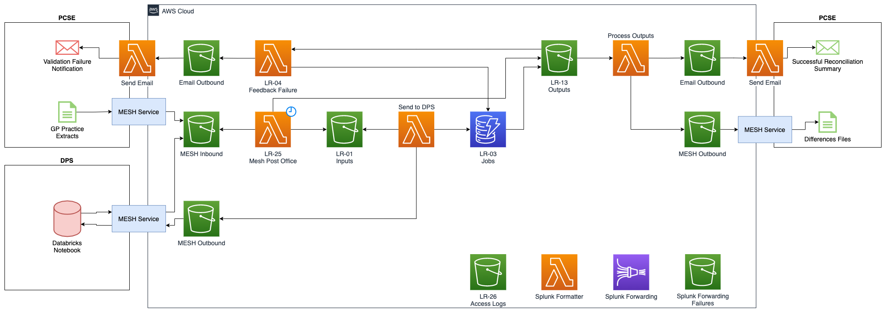

# List Reconciliation v2

## Overview

A decision has been made to evolve the List Reconciliation architecture from the [previous AWS based design](../kad/list-rec-v1.md) to a new Hybrid [DPS Service](../kad/list-rec-v2.md#decision) based approach. The key reason for this being access to the PDS data, that was not able to be met by the PDS FHIR API but as DPS now has a full PDS dataset

Placing the data processing within a system designed for processing large scale datasets and which has the PDS dataset reduces the amount of duplicate work, to build a data processing capability, and transfer and storage costs of data, as PDS is accessed locally inside DPS rather than an exported copy being sent to List Reconciliation

However the processing of the reports and downstream actions, like DSA Work Item creation, summary emails and MESH Sending of files will still be handled in a set of AWS built services

This document outlines a potential [Architecture Diagram](#architecture-diagram), how [Data Flows through the new DPS based processing](#data-processing-flow) and areas where work needs to be done to [Transition from v1 to v2](#transition-from-v1-to-v2)

## Architecture Diagram

## Data Processing Flow

### PCSE

This is the start of the process, GP Extracts are collated from GP Systems Suppliers by PCSE and prepared to be sent to List Reconciliation

#### GP Practice Extracts

The GP Files must meet the [input files specification](../specifications/input-specification.md) for all records and the filename

#### MESH Outbound

The GP Extract Files are then sent over MESH to List Reconciliation

### MESH

We use the [Spine AWS Common - MESH AWS](https://github.com/joeds13/spine-core-aws-common/blob/splunk-forwarding/terraform/mesh_aws/README.md) application to provide MESH services on AWS for List Reconciliation

#### MESH Service

MESH AWS polls the MESH mailbox for new messages, if it finds one it'll download it and store it into List Reconciliation's Inbound Bucket

#### MESH Inbound Bucket

The GP Extracts then sit here to be picked up by List Reconciliation, we download but don't directly process the messages to ensure we don't create a backlog of messages in the MESH Mailbox in times where we may not want to be processing them

### List Reconciliation Services

Here we enter the AWS Services that are built specifically for List Reconciliation

#### MESH Post Office

This services checks for received MESH messages on a schedule, we do this as we may not want to process downstream messages, during an incident or deployment for example, and this service is configurable to be "switched off" with a parameter to not move files that would then result in the processing being started

#### Inputs Bucket

Here the GP Extracts are stored and then an S3 trigger will call the [Send to DPS Lambda](#send-to-dps-lambda)

#### Send to DPS Lambda

This Lambda will take a GP Extract File, create a job to keep track of the processing in the [Jobs DynamoDB Table](#jobs-dynamodb-table) and then run the [validation of it's filename](../specifications/input-specification.md#filename) and if it passes, will put the file into the [MESH Outbound Bucket](#mesh-outbound-bucket) for sending to DPS. If it does not pass, we will put the file into the [Failed Validation Flow](#failed-validation-flow)

#### Jobs DynamoDB Table

The Jobs table stores the current status of the Job as well as any statistics that will be used for reporting and notification purposes, such as counts of total number of patients, number of validation failures and number of comparison differences found for example

#### MESH Outbound Bucket

Files in here are picked up by the MESH Service to be passed on to DPS

### MESH

We use the [Spine AWS Common - MESH AWS](https://github.com/joeds13/spine-core-aws-common/blob/splunk-forwarding/terraform/mesh_aws/README.md) application to provide MESH services on AWS for List Reconciliation

#### MESH Service

MESH AWS is notified of a new outbound message in the bucket and will take the message and send it to the desired MESH Mailbox

### DPS

The [Data Processing Services (DPS)](https://digital.nhs.uk/data-and-information/data-insights-and-statistics/improving-our-data-processing-services) is based on the [Databricks](https://databricks.com/) platform, allowing for [Spark](https://spark.apache.org/) to be run at scale to process data

#### Ingestion Notebook

Within DPS, the ingestion notebook is a shared notebook that handles the initial processing of all received files, this will take the MESH received GP Extract file and upon ensuring the metadata of the MESH message is as expected, will pass the file on to the [List Reconciliation Notebook](#list-reconciliation-notebook)

#### List Reconciliation Notebook

This notebook does the data processing of the GP Extracts file, first it will pass all records through the [record validations](../specifications/input-specification.md#records-1) if these fail then and output is generated and passed to MESH to send back List Reconciliation. If the validations pass, then the [comparison differences](../specifications/differences-specification.md#mvp-comparison-rules) are run and a output is again generated and passed to MESH for return to List Reconciliation

The generated reports from DPS are structured documents sent as [JSON Lines](https://jsonlines.org/) files, this allows easier downstream processing for List Reconciliation. DPS will return all difference data from PDS to List Reconciliation as it needs to be compiled into the [outputs for PCSE](#successful-flow) as well as potentially in future work to create DSA Work Items

### MESH

We use the [Spine AWS Common - MESH AWS](https://github.com/joeds13/spine-core-aws-common/blob/splunk-forwarding/terraform/mesh_aws/README.md) application to provide MESH services on AWS for List Reconciliation

#### MESH Service

MESH AWS polls the MESH mailbox for new messages, if it finds one it'll download it and store it into List Reconciliation's Inbound Bucket

#### MESH Inbound Bucket

The GP Extracts then sit here to be picked up by List Reconciliation, we download but don't directly process the messages to ensure we don't create a backlog of messages in the MESH Mailbox in times where we may not want to be processing them

### List Reconciliation Services

Here we return to the AWS Services that are built specifically for List Reconciliation

#### MESH Post Office

This services checks for received MESH messages on a schedule, we do this as we may not want to process downstream messages, during an incident or deployment for example, and this service is configurable to be "switched off" with a parameter to not move files that would then result in the processing being started

#### Outputs Bucket

The reports from DPS are then stored into the Outputs Bucket, we do this so we can control the retention of these files to meet any reporting and data security requirements. Success outputs will then go on to trigger the [Successful Flow](#successful-flow) with validation failure outputs triggering the [Failed Validation Flow](#failed-validation-flow)

### Failed Validation Flow

Here we handle files that DPS hasn't passed through the comparison due to validations failing

#### Feedback Failure Lambda

We then process the returned outputs from DPS, collating the job statistics and storing them into [Jobs DynamoDB Table](#jobs-dynamodb-table). We then take those statistics and create the feedback failure email and place that into the outbound email bucket for sending.

#### Email Outbound Bucket

Here the outbound email message us placed, containing the message body, subject and recipients

#### Send Email Lambda

This process picks up a message from S3 and sends it via the NHS Mail relay. This is a decoupled process as any code needing to speak to the NHS Mail relay needs to have outbound internet access and we do not want the services that can access the patient data containing reports to have outbound internet access

#### Validation Failure Notification

PCSE receive the email, sent over NHS Mail, into their mailbox containing a summary of the failed validations

### Successful Flow

Here we handle files the DPS has successfully validated and compared against PDS

#### Process Outputs Lambda

We then process the returned outputs from DPS, collating the job statistics and storing them into [Jobs DynamoDB Table](#jobs-dynamodb-table). We then take those statistics and create the success summary email and place that into the outbound email bucket for sending. Finally, we take the DPS Output and convert it into the expected [output formats](../specifications/output-specification.md) and place them into the MESH outbound bucket

#### Notification Flow

Here we send a summary notification of a successful job to PCSE and information about the reports that have been generated and [sent back to them over MESH](#outputs-flow)

##### Email Outbound Bucket

Here the outbound email message us placed, containing the message body, subject and recipients

##### Send Email Lambda

This process picks up a message from S3 and sends it via the NHS Mail relay. This is a decoupled process as any code needing to speak to the NHS Mail relay needs to have outbound internet access and we do not want the services that can access the patient data containing reports to have outbound internet access

##### Successful Reconciliation Notification

PCSE receive the email, sent over NHS Mail, into their mailbox containing a summary of the successful reconciliation and information about the returned reports

#### Outputs Flow

Here we send the actual reports back to PCSE

#### MESH Outbound Bucket

Files in here are picked up by the MESH Service to be passed on to PCSE

### MESH

We use the [Spine AWS Common - MESH AWS](https://github.com/joeds13/spine-core-aws-common/blob/splunk-forwarding/terraform/mesh_aws/README.md) application to provide MESH services on AWS for List Reconciliation

#### MESH Service

MESH AWS is notified of a new outbound message in the bucket and will take the message and send it to the desired MESH Mailbox

### PCSE

This is the end of the process, PCSE have now received the Output Files and can take any required actions

#### MESH Inbound

PCSE will receive the files back to their MESH Mailbox

## Transition from v1 to v2

_**Comments here are as of October 2021**_

The desired approach follows in how the Risk Stratification project worked with DPS by using a hybrid model, where we use DPS to do the large-scale data processing and then outputs handed back to List Reconciliation to process

This reduces the coupling between List Reconciliation and DPS, avoiding the contention in the DPS development and release processes (as this mirrors the desire to decouple List Reconciliation from the Spine development and release processes). This also allows reuse of some of the existing AWS/Spine solution that has already been developed.

From a Spine operational point of view, the data processing in DPS happens as a "third party", so when it comes to Spine Triage incidents, depending at what point in the process the incident is raised they could be passed over to DPS.

With this approach we still need to keep in mind additional Spine work will be required by the PCRM team to build a service around DPS solution.

### Q&As

#### Which components still need to be built?

The major identified areas that need to be developed are the process to send files to DPS, however this makes use of MESH sending and existing validation code for the filenames, so this a fairly understood piece of development. Secondly the process to take DPS outputs and turn them into the expected CSV outputs, again this an make use of existing code and again uses MESH to send which makes use of existing code

#### What can be reused from the current AWS solution?

Many of the components can be removed, which massively reduces the maintenance and operational burden of List Reconciliation, however the libraries developed for validations and outputs can be reused into the new components required.

#### What exists in DPS we can make use of?

DPS is a mature service, with existing code and patterns for the large scale data processing and axillary services like sending and receiving files over MESH

#### What will the support model look like?

From an operation point of view DPS is treated as third party, so when it comes to Spine Triage incidents, they can be escalated to DPS.

#### How might Spine triage deal with a List Rec issue/incident?

Triage identifies which point the incident failed and if DPS then escalate, a formal process needs to be set up and put in place before go live.

#### Where do we need to log to?

Logging in place enough to triage incidents and work out where it has failed. DPS logs to Splunk Cloud, so we can look to get access for Spine engineers or we can look to forward logs from DPS

#### What sends out failure emails?

With the hybrid model List Reconciliation services will be responsible for sending out any email notifications

#### Are there any cross-directorate infrastructure costs?

PCRM team to provide DPS with a capacity estimation. Pull together some stats to help DPS assess short term and long term goals. List Reconciliation will start with 2/3 files per GP practice a day to daily patient checks in the future

#### How do we get GP Files to DPS?

Spine to keep ownership of the receiving of files from PCSE, it will then use MESH again to pass the inputs and receive the outputs from DPS

#### Do the file validation in Spine or DPS?

List Reconciliation will handle the full filename validation and will not pass a file to DPS if that validation fail. As the record level validations need to happen at scale, they will take place in DPS, with validation failures being returned as outputs

#### Where do we keep the report outputs?

List Reconciliation will retain copies of all inputs and outputs inline with it's data retention and reporting requirements

### Requirements

Here we have an Epic to cover [DPS Data Processing solution to support a List Reconciliation Service](https://nhsd-jira.digital.nhs.uk/browse/PCRM-4516) which outlines collaborative work between List Reconciliation and DPS to create the Hybrid Model:

- Incident Process [PCRM-4552](https://nhsd-jira.digital.nhs.uk/browse/PCRM-4552)
- Logging and Debugging [PCRM-4553](https://nhsd-jira.digital.nhs.uk/browse/PCRM-4553)
- Input Files and Triggering [PCRM-4554](https://nhsd-jira.digital.nhs.uk/browse/PCRM-4554)
- Output Files [PCRM-4555](https://nhsd-jira.digital.nhs.uk/browse/PCRM-4555)
- Capacity Planning [PCRM-4556](https://nhsd-jira.digital.nhs.uk/browse/PCRM-4556)
- Validations [PCRM-4557](https://nhsd-jira.digital.nhs.uk/browse/PCRM-4557)
- Differences and Comparisons [PCRM-4558](https://nhsd-jira.digital.nhs.uk/browse/PCRM-4558)

Here is a second Epic to cover [List Reconciliation Service Hybrid Model with DPS](https://nhsd-jira.digital.nhs.uk/browse/PCRM-4572) which outlines the work required to transform the existing AWS Solution into the Hybrid Model:

- Removal of superseded components [PCRM-4581](https://nhsd-jira.digital.nhs.uk/browse/PCRM-4581)
- Send to DPS [PCRM-4582](https://nhsd-jira.digital.nhs.uk/browse/PCRM-4582)
- Process DPS Outputs [PCRM-4583](https://nhsd-jira.digital.nhs.uk/browse/PCRM-4583)
- MESH Sending for DPS Inputs [PCRM-4588](https://nhsd-jira.digital.nhs.uk/browse/PCRM-4588)
- Jobs Table consolidation [PCRM-4584](https://nhsd-jira.digital.nhs.uk/browse/PCRM-4584)
- Create Test Data [PCRM-4585](https://nhsd-jira.digital.nhs.uk/browse/PCRM-4585)
- Forwarding logs to Splunk [PCRM-4586](https://nhsd-jira.digital.nhs.uk/browse/PCRM-4586)
- Removal of PDS API Access [PCRM-4587](https://nhsd-jira.digital.nhs.uk/browse/PCRM-4587)
